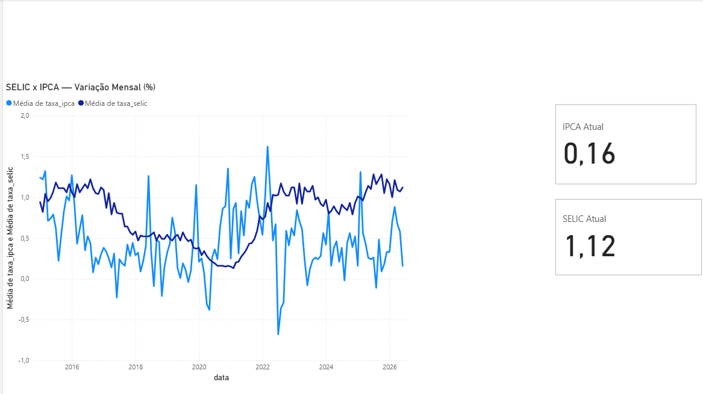

# 📊 Indicadores Econômicos do Brasil — Pipeline BCB → Power BI

Pipeline de dados que extrai indicadores oficiais da economia brasileira direto da API do Banco Central, trata e consolida os dados, e alimenta um dashboard interativo no Power BI.

## 🎯 Sobre o projeto

Este projeto automatiza a coleta de dois indicadores macroeconômicos essenciais — a **taxa SELIC** e o **IPCA** mensal — e os transforma em um painel visual pronto para apoiar decisões financeiras e de negócio.

O pipeline segue quatro etapas:

1. **Extração** — consome a API pública do Sistema Gerenciador de Séries Temporais (SGS) do Banco Central do Brasil
2. **Tratamento** — limpa, tipifica e cruza os dados usando Pandas
3. **Armazenamento** — persiste os dados consolidados em um banco SQLite local
4. **Visualização** — conecta o Power BI diretamente ao banco, exibindo gráfico histórico e indicadores do mês mais recente

## 🛠️ Tecnologias utilizadas

- **Python** — linguagem principal do pipeline
- **Requests** — consumo da API do Banco Central
- **Pandas** — limpeza, tratamento e cruzamento dos dados
- **SQLite** — armazenamento local dos dados tratados
- **Power BI** — visualização e dashboard interativo (conexão via conector de Script Python)

## 📁 Estrutura do projeto
